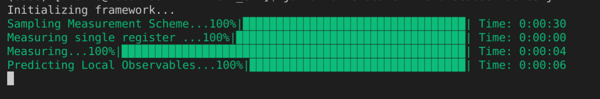

# QfeatQ

Quantum feature aQuisition framework


## Usage

### Create Experiments from Example Experiments
<ul>
<li>Use experiments in examples folder</li>
</ul> 

### Create Experiments from Basic Simulation Templates:
<ul>
<li> Use simulation & observable templates in templates folder</li>
<li> 4 options: (local measurements or global measurements) and (stabilizer representation or matrix/array representation) </li>
</ul> 

### Create Experiments from Scratch:

<ul>
<li>Create Custom experiments/simulations/tests with core framework.</li>
<li> Minimal Experiment Controller file:

```julia
using LinearAlgebra
using Statistics
using HDF5
using JLD

#Import framework:
include("QfeatQ.jl")

function mainExperimentController(system_size, subsystem_dim, number_of_measurements,  observableFile="observables.txt")

    QfeatQ.initialize(system_size, subsystem_dim)
    
    #Generate states to simulate on:
    tableauStateMemory = QfeatQ.state_generation_Controller("rp-stab", system_size, subsystem_dim, "systemState.txt")
    
    #Create a measurement_procedure: Randomized : GLOBAL
    cliffMeasScheme = QfeatQ.create_data_acquisition_scheme_Controller("rc", number_of_measurements, system_size,subsystem_dim, observableFile, false)

    #Measure based on GLOBAL measurement scheme:
    cliffordOutcomes = QfeatQ.measurement_Controller("clifford-eff-global", true, system_size,subsystem_dim, cliffMeasScheme, tableauStateMemory)
    
    #Post-process (classical shadows) the measurement outcomes & Predict observables
    #Observable Predictions
    
    predictions = round.(QfeatQ.observable_prediction_Controller("cShadowClifford-stab", "lo", system_size, subsystem_dim, observableFile, cliffordOutcomes, cliffMeasScheme) ,digits=10)

    trueExpectations = QfeatQ.observable_prediction_Controller("truthPauli", "o-eff", system_size,subsystem_dim, observableFile, nothing, cliffMeasScheme, stateCopy)


    error = abs.(predictions .- trueExpectations)
    return convert(Array{Float64, 1},predictions), convert(Array{Float64, 1},truePredictionArray), convert(Array{Float64, 1}, error)
end

mainExperimentController(3, 4, 400, string("observables.txt"))

```
</li>
  <li>
Basic Observable file:
      
```txt
[system_size] [subsystem_dim]
[Real Weight] [Imag. Weight] [Phase (Power)] [qn1]|X[xp1]Z[zp1] [qn2]|X[xp2]Z[zp2] ........
.
.
.
.
.
```
</li>
</ul> 


Based on https://github.com/momohuang/predicting-quantum-properties
